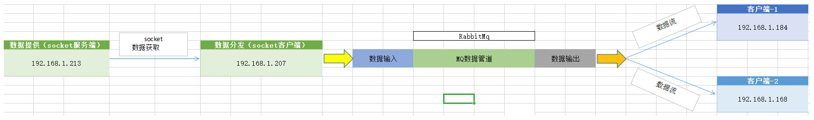
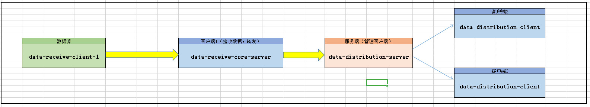

# Getting Started

## 一、父项目
### 1.1 需求
* 数据分发,实现一个数据源的数据分流和重复利用
* 数据分发系统实现HA（高可用）、HB（高负载）、HPC（高并发）
### 1.2 方案
#### 1.2.1 方案一（socket的广播机制）
```
socket(服务端) -> socket（客户端，接收数据）->socket(转服务端，分发数据，最好时带加密)
-> socket(客户端1)->实现业务1
-> socket(客户端2)->实现业务2
```
#### 1.2.2 方案二（重复消费消息）
```
socket(服务端) -> socket（客户端，接收数据，分发到RabbitMq）->RabbitMQ(实现数据的实时发送和定时清理)
-> 业务端从MQ中实时读取数据处理->实现业务1
-> 业务端从MQ中实时读取数据处理-->实现业务2
```

数据分发方案图-MQ：

#### 1.2.3 部署架构图
```
data-receive-client-1(192.168.1.213) -> data-distribution-server(192.168.1.207，服务器)
->data-receive-core-server(192.168.1.207，数据转发核心)->data-distribution-client(192.168.1.184,客户端1)
->data-distribution-client(192.168.1.168,客户端2)
```
数据分发部署架构图-Netty：

## 参考文档
### Springboot 多模块开发依赖参考
* [Spring Boot 多模块开发-使用dependencyManagement版本管理](https://blog.csdn.net/qq_37604508/article/details/83064513)
* [spring boot不用parent引入，采用dependencyManagement引入后的坑](https://blog.csdn.net/NeverSad_/article/details/87270145)
* [Spring Boot 使用dependencyManagement版本管理](https://blog.csdn.net/acmer_ak/article/details/79364983)
* [dependencyManagement-关于spring boot-官网解释](https://docs.spring.io/spring-boot/docs/current-SNAPSHOT/reference/htmlsingle/#using-boot-maven-without-a-parent)
* [dependencyManagement-关于spring cloud-官网解释](https://cloud.spring.io/spring-cloud-static/Greenwich.SR3/multi/multi__spring_cloud_contract_verifier_setup.html#maven-add-plugin)
### Reference Documentation
For further reference, please consider the following sections:

* [Official Apache Maven documentation](https://maven.apache.org/guides/index.html)
* [Spring Boot Maven Plugin Reference Guide](https://docs.spring.io/spring-boot/docs/2.1.9.RELEASE/maven-plugin/)
* [Spring Boot Actuator](https://docs.spring.io/spring-boot/docs/2.1.9.RELEASE/reference/htmlsingle/#production-ready)
* [Spring Web](https://docs.spring.io/spring-boot/docs/2.1.9.RELEASE/reference/htmlsingle/#boot-features-developing-web-applications)
* [Spring Configuration Processor](https://docs.spring.io/spring-boot/docs/2.1.9.RELEASE/reference/htmlsingle/#configuration-metadata-annotation-processor)
* [Spring for RabbitMQ](https://docs.spring.io/spring-boot/docs/2.1.9.RELEASE/reference/htmlsingle/#boot-features-amqp)
* [MyBatis Framework](https://mybatis.org/spring-boot-starter/mybatis-spring-boot-autoconfigure/)

### Guides
The following guides illustrate how to use some features concretely:

* [Building a RESTful Web Service with Spring Boot Actuator](https://spring.io/guides/gs/actuator-service/)
* [Building a RESTful Web Service](https://spring.io/guides/gs/rest-service/)
* [Serving Web Content with Spring MVC](https://spring.io/guides/gs/serving-web-content/)
* [Building REST services with Spring](https://spring.io/guides/tutorials/bookmarks/)
* [Messaging with RabbitMQ](https://spring.io/guides/gs/messaging-rabbitmq/)
* [MyBatis Quick Start](https://github.com/mybatis/spring-boot-starter/wiki/Quick-Start)

